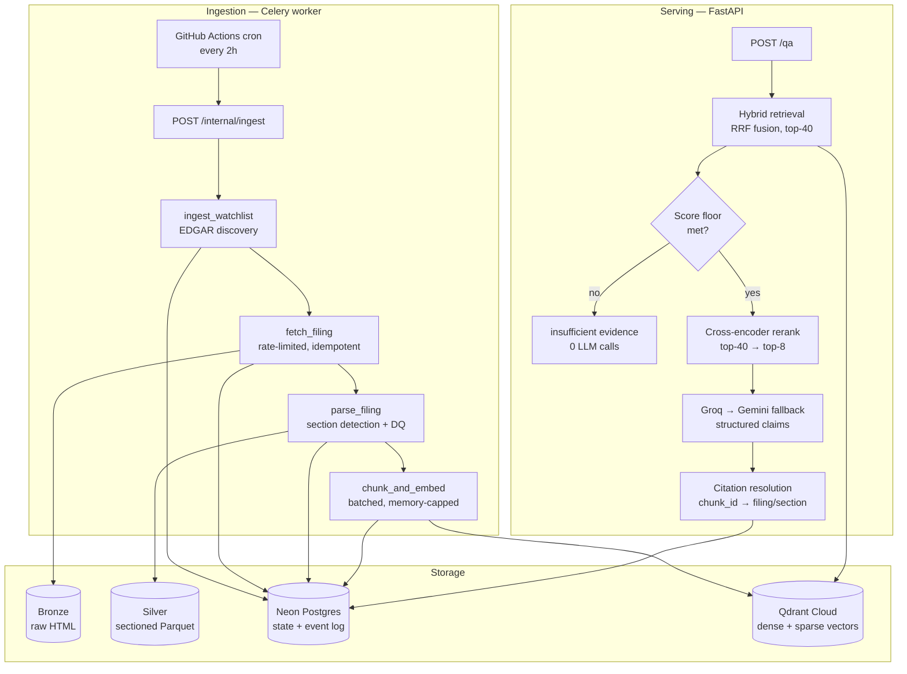

# FilingSage

**An AI research analyst that watches SEC filings and answers questions about them — with citations traced back to the exact filing section.**

Point it at a list of tickers. It discovers every new 10-K, 10-Q, and 8-K from SEC EDGAR, parses them into sections, embeds them into a hybrid vector store, and answers natural-language questions with claims mapped to their source. When the filings don't support an answer, it says so instead of guessing.

**Status:** Weeks 1–2 complete and verified end-to-end in production. The full pipeline — discovery → fetch → parse → chunk → embed → hybrid retrieval → rerank → cited generation — runs against real EDGAR data. Weeks 3+ (agent orchestration, email briefs, auth, frontend) are roadmap.

---

## What actually works right now

| Capability | Status |
| --- | --- |
| SEC EDGAR ingestion (10-K / 10-Q / 8-K), rate-limited and idempotent | ✅ Shipped |
| Automated scheduled ingestion — GitHub Actions cron, every 2h | ✅ Shipped |
| Bronze → silver → gold medallion pipeline | ✅ Shipped |
| Section-aware parsing across all three form types | ✅ Shipped |
| Hybrid vector search — BGE-small dense + BM25 sparse, RRF-fused | ✅ Shipped |
| Cross-encoder reranking, top-40 → top-8 | ✅ Shipped |
| Cited Q&A — each claim mapped to the chunks supporting it | ✅ Shipped |
| "Never bluff" gate — insufficient evidence returns with **zero** LLM calls | ✅ Shipped |
| Public `POST /qa` endpoint with Redis-backed rate limiting | ✅ Shipped |
| Failure recovery tooling (`recover-stale`) | ✅ Shipped |
| NLI claim verification | 🗺️ Roadmap |
| Confidence gate + retrieval retry | 🗺️ Roadmap |
| LangGraph agent orchestration | 🗺️ Roadmap |
| Email briefs on new filings | 🗺️ Roadmap |
| JWT auth + per-user quotas | 🗺️ Roadmap |
| Web frontend | 🗺️ Roadmap |

**Scale so far:** ~1,000 filings discovered across a 10-ticker watchlist · 87 tests.

---

## A real answer, end to end

```bash
curl -X POST https://filingsage-api.fly.dev/qa \
  -H "Content-Type: application/json" \
  -d '{"question": "What are Apple'\''s main competitive risks?", "ticker": "AAPL"}'
```

```json
{
  "answer": "Apple's competitive risks stem from several sources. First, the company faces aggressive price competition and very low-cost business models from rivals, which puts downward pressure on its gross margins. Second, the markets for its products and services are characterized by rapid technological change, short product life cycles, and frequent new-product introductions...",
  "claims": [
    {
      "text": "Aggressive price competition and low-cost structures of rivals create downward pressure on Apple's gross margins.",
      "chunk_ids": [2582, 2706, 1550, 1417]
    },
    {
      "text": "Competitors often imitate Apple's products and may infringe on its patents, trademarks and copyrights.",
      "chunk_ids": [2582, 2706, 1550, 1417]
    }
  ],
  "confidence": "high",
  "insufficient_evidence": false
}
```

Every `chunk_id` resolves back to a specific filing, form type, filing date, and section. Ask it something the corpus can't support and it returns `insufficient_evidence: true` — without calling an LLM at all.

> **Note on the live demo:** the deployment is real and was verified end-to-end in production. The hosted API is currently paused to avoid running costs on a personal project; everything below runs locally against the same managed services.

---

## Architecture



**Design commitments worth naming:**

- **Bronze is a cache, not a system of record.** EDGAR is the source of truth; every derived artifact is rebuildable. This turned a destroyed production volume from a disaster into a one-command recovery.
- **Every state change emits an event in the same transaction** — a transactional outbox, so the audit log can never disagree with the database.
- **Every pipeline step is idempotent**, keyed by accession number, so at-least-once delivery is safe by construction.
- **Failures fail closed.** A Qdrant outage mid-embed leaves a filing un-advanced and retryable, never half-embedded and marked done.

---

## The retrieval pipeline

| Stage | What it does | Why |
| --- | --- | --- |
| **Chunking** | 384-token windows, 64-token overlap, snapped to word boundaries | Sized *under* BGE-small's 512 ceiling on purpose — leaves room for special tokens, and tighter spans embed more precisely. Boundaries use the same tokenizer the embedder uses. |
| **Dense embedding** | BGE-small-en-v1.5 (ONNX via FastEmbed) | Semantic similarity — "revenue declined" matches "sales fell" with no shared words. |
| **Sparse embedding** | BM25-family, IDF modifier enabled | Filings are full of terms that must match *exactly*: ticker symbols, dollar figures, defined terms like "Material Adverse Effect." Pure semantic search drifts on these. |
| **Fusion** | Qdrant-native Reciprocal Rank Fusion, top-40 | Dense and sparse scores aren't on a comparable scale. RRF fuses by *rank position*, sidestepping normalization entirely. |
| **Filtering** | Payload filters on ticker / form type / filing date | Applied per-prefetch — a top-level filter is silently ignored on a fusion query. |
| **Reranking** | MS MARCO MiniLM cross-encoder, top-40 → top-8 | Scores the (query, chunk) pair directly rather than inferring relevance from two independent retrieval signals. |
| **Generation** | Groq primary, Gemini fallback, Pydantic-validated output | Structured `answer + claims[]`, each claim carrying the chunk IDs it rests on. |
| **Grounding** | Hallucinated citations dropped before display | If the model cites a chunk it was never shown, that citation is stripped. |

---

## Stack

| Layer | Choice |
| --- | --- |
| API | FastAPI · Uvicorn |
| Async pipeline | Celery · Redis (Upstash) |
| Database | Postgres (Neon) · SQLAlchemy · Alembic |
| Vector store | Qdrant Cloud (hybrid: named dense + sparse vectors) |
| Analytics | DuckDB over silver Parquet |
| Models | FastEmbed / ONNX — BGE-small, BM25, MS MARCO MiniLM cross-encoder |
| LLM | Groq (primary) → Gemini (fallback) |
| Parsing | selectolax (Lexbor) · PyArrow |
| Deploy | Fly.io (two apps, one image) · Docker · GitHub Actions |
| Tests | pytest · testcontainers |

---

## Running locally

```bash
git clone https://github.com/aryadoshii/filingsage
cd filingsage

python -m venv .venv && source .venv/bin/activate
pip install -e .

cp .env.example .env
# Required: SEC_CONTACT_EMAIL (SEC fair-access policy mandates a real contact)
# For retrieval + Q&A: QDRANT_URL, QDRANT_API_KEY, GROQ_API_KEY, GEMINI_API_KEY

docker compose up -d postgres redis
python -m alembic upgrade head
```

**Ingest, search, ask:**

```bash
python -m filingsage.cli ingest --tickers AAPL --limit 5
python -m filingsage.cli search "risks related to competition" --ticker AAPL --limit 5
python -m filingsage.cli ask "What are Apple's main competitive risks?" --ticker AAPL
```

**Recover from data loss** (rebuilds anything whose local files are gone, from EDGAR):

```bash
python -m filingsage.cli recover-stale --dry-run
python -m filingsage.cli recover-stale
```

**Tests:**

```bash
pytest              # 87 tests; some use testcontainers and need Docker running
ruff check src tests
```

---

## Notable technical decisions

Every non-obvious choice here is documented with its reasoning, the alternative rejected, and the threshold at which it'd be revisited. A few of the more interesting ones:

- **DuckDB + Parquet over Spark/Iceberg** — data volume is single-digit GB. A distributed engine solves a problem this project doesn't have.
- **FastEmbed/ONNX over a PyTorch stack** — the original plan assumed a 24GB VM that never materialized. ONNX models fit a 1GB box where PyTorch wouldn't.
- **Hand-rolled rate limiter over `tenacity`** — ~25 lines, fully explainable, with SEC-specific behavior (403 as throttle signal, `Retry-After` honored, jitter).
- **Both spec-named models were swapped after verification, not assumption** — Groq's `llama-3.3-70b-versatile` had been deprecated; `bge-reranker-base` measured at ~2GB to load, over twice the available budget. Both replacements were checked against real docs and real memory numbers first.
- **Measured before fixing, and the intuitive fix was wrong** — an OOM looked like "two models resident at once." Measuring showed the sparse model costs 0.2MB; FastEmbed's BM25 isn't a neural model at all. The obvious fix would have saved nothing.
- **A rate limiter that didn't limit anything** — forging `X-Forwarded-For` against the live deployment showed Fly *prepends* rather than replaces, making the limit bypassable by anyone setting a header. `Fly-Client-IP` proved unspoofable under the same test.

📄 **[Full decision log →](docs/DECISIONS.md)** — all 29 entries, including the production incidents and what they cost to learn.

---

## Honesty

Roadmap features are labeled roadmap — here and in interviews. Every measurement quoted in this repo was taken with the method named alongside it, and several of those measurements overturned the hypothesis that prompted them; those reversals are recorded rather than quietly dropped.

---

*Built by [Arya Doshi](https://github.com/aryadoshii). Full design document: [`docs/filingsage-spec.md`](docs/filingsage-spec.md).*
